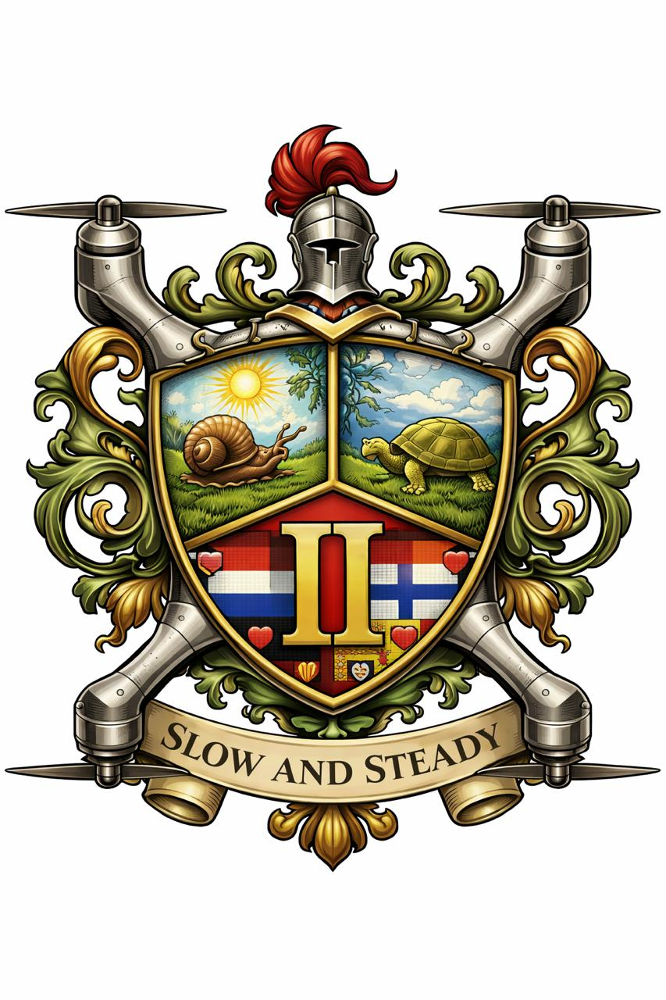

# BIP group II

## Presentation
[presentation](slides.ppt)  
## Coat Of Arms

## Team
- Duncan
- Nitesh
- Roshan
- Wesley
- Robin
- Ángel
- Joris
## Deliverables
1. BMC  
[BMC](BMC.jpg)
2. Risk Management Plan  
[Risk Management Plan](RiskManagementProtocol.pdf)
3. Drone Simulation POC  
[drone video](https://www.youtube.com/watch?v=u3l3wdLXeZ4&feature=youtu.be)
python + json files = source code  
6. Data Management & Visualization Simulation  
[visualization](visualization.pdf)  
7. Crisis Management Protocol  
[Crisis Management Protocol](cmp.pdf)  
[Flowchart](flowchart.svg)  
8. Data protection when using AI    
[Data Protection when using AI](DataProtection.pdf)

